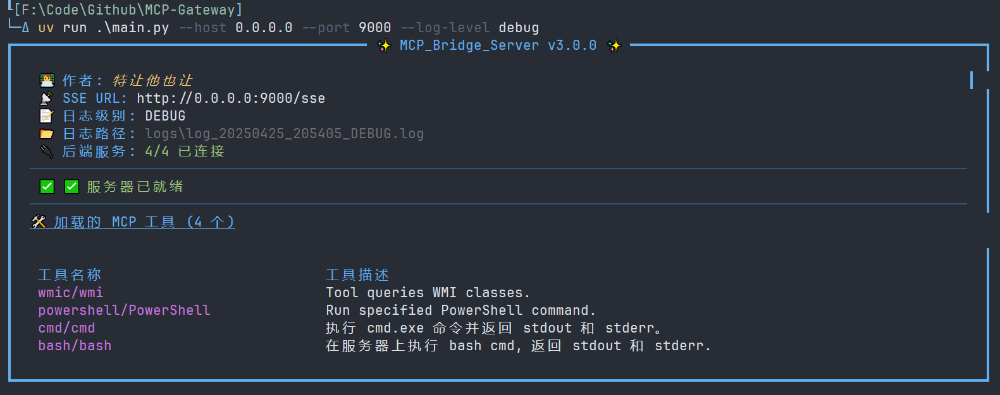
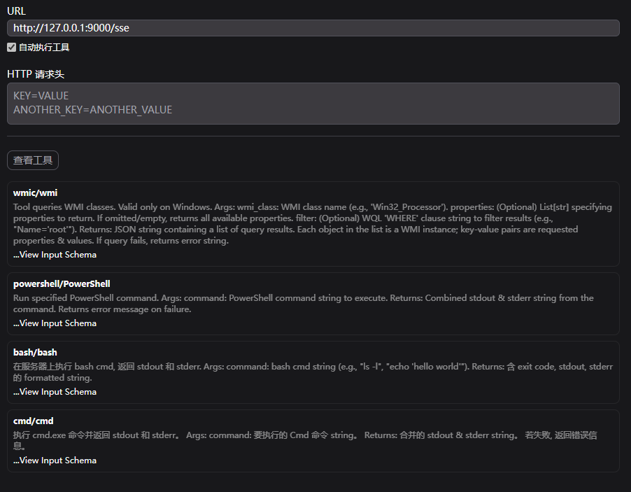
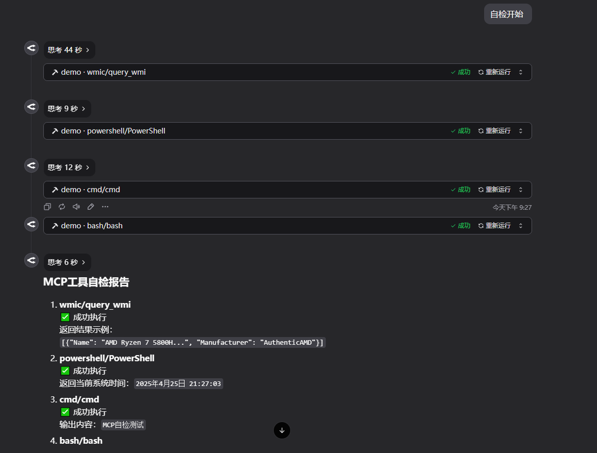
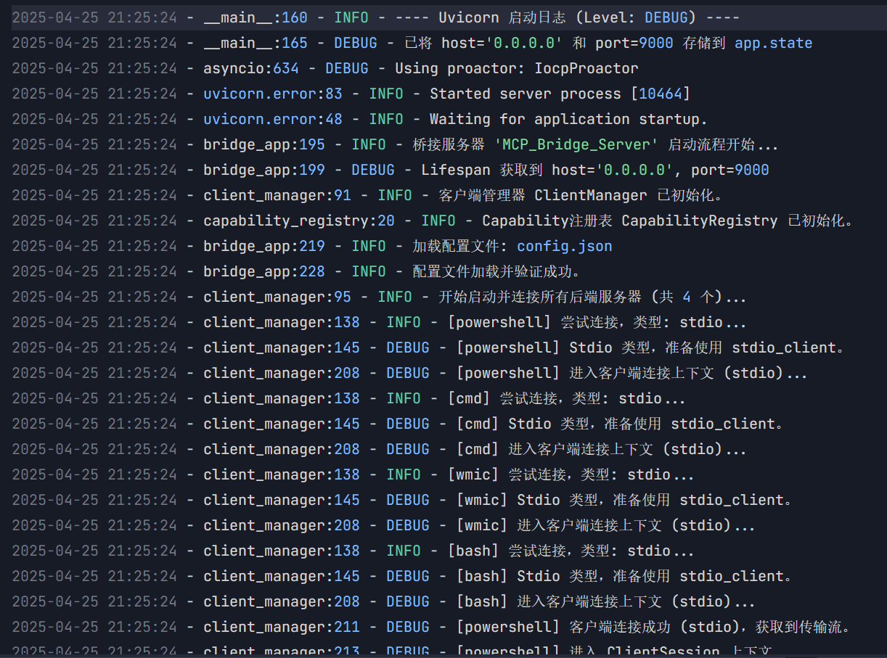
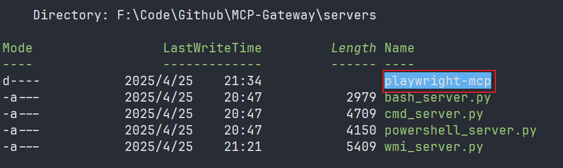
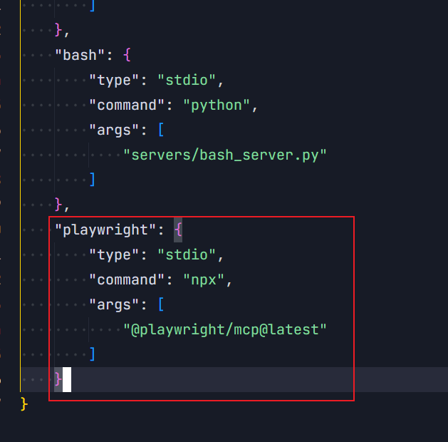
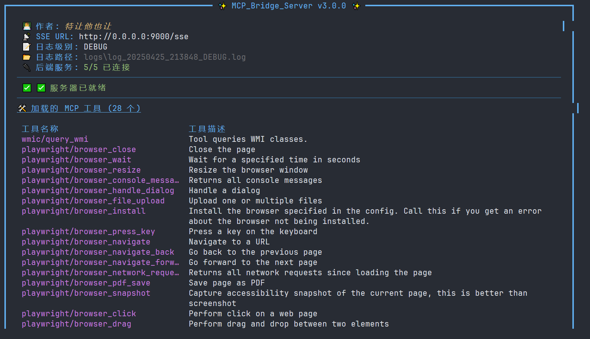
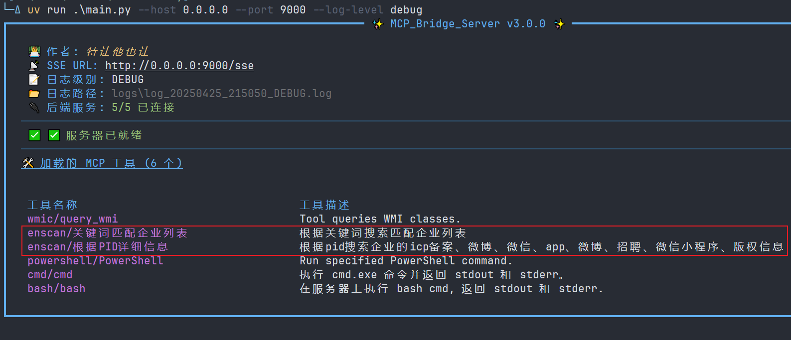

# MCP Gateway

## 项目概述

MCP Gateway 是一个基于 Python Starlette 构建的应用程序，旨在作为一个**中央网关**，连接并聚合来自多个后端 MCP 服务器（无论是通过 Stdio 还是 SSE 协议通信），并通过一个单一的 **SSE** 端点暴露给 MCP 客户端。

这使得 MCP 客户端只需连接到这个桥接服务器，即可访问所有已配置后端服务器的功能，极大地简化了客户端配置和管理。

**更重要的是，通过这种能力聚合，我们可以将不同来源、具备多样能力的 MCP 工具灵活组合，从而构建出专注于特定任务领域的、功能更加强大的定制化智能体。**

## 项目文件结构

```
.
├── config.json                 # 核心配置文件，定义要连接的后端 MCP 服务器
├── main.py                     # 程序入口，负责启动服务器和设置日志
├── bridge_app.py               # Web 应用核心，处理 MCP 请求转发和 SSE 连接
├── client_manager.py           # 管理与后端 MCP 服务器的连接
├── capability_registry.py      # 发现、注册并管理来自后端的能力 (Tools, Resources, Prompts)
├── config_loader.py            # 加载并验证 config.json 文件
├── errors.py                   # 定义自定义异常类
├── rich_handler.py             # Rich 库的日志处理器，用于美化控制台输出
├── servers/                    # 存放示例后端 MCP 服务器
│   ├── bash_server.py          # <-- 内置 Bash 命令执行工具
│   ├── cmd_server.py           # <-- 内置 Windows CMD 命令执行工具
│   ├── powershell_server.py    # <-- 内置 Windows PowerShell 命令执行工具
│   └── wmi_server.py           # <-- 内置 Windows WMI 查询工具
└── logs/                       # 存放运行时生成的日志文件 (自动创建)
```

## 内置 MCP Server

本项目内置了三个 MCP 工具：

- Bash 命令执行工具
- Windows CMD 命令执行工具
- Windows PowerShell 命令执行工具
- Windows WMI 查询工具

这些可以直接使用，无需额外配置。

## 安装与设置

本项目是基于 Python 编写，由 uv 进行管理。

克隆本仓库

```
git clone https://github.com/trtyr/MCP-Gateway.git
```

创建并激活虚拟环境

```
uv venv
source .venv/bin/activate # Linux/macOS
venv\Scripts\activate     # Windows
```

安装依赖

```
uv sync
```

这样就可以使用了

## 快速启动

### 获取项目帮助

使用如下命令可获取项目帮助

```
uv run .\main.py -h
```

得到如下结果

```
usage: main.py [-h] [--host HOST] [--port PORT] [--log-level {debug,info,warning,error,critical}] [--reload]

启动 MCP_Bridge_Server v3.0.0

options:
  -h, --help            show this help message and exit
  --host HOST           主机地址
  --port PORT           端口
  --log-level {debug,info,warning,error,critical}
                        设置文件日志级别 (默认为 info)
  --reload              启用自动重载
```

### 启动项目

使用如下命令可启动项目

```
uv run .\main.py --host 0.0.0.0 --port 9000 --log-level debug
```



### MCP Client 连接

使用任意 MCP Client 连接到 MCP Gateway





### 日志

日志文件位于项目根目录下的 `logs` 文件夹中。



## 配置文件

配置文件位于项目根目录下的 `config.json` 文件。所有 MCP 工具的配置都应在此文件中进行。

分为两种类型：

- **Stdio 类型**：通过标准输入输出与 MCP 工具进行通信。
- **SSE 类型**：通过 Server-Sent Events 协议与 MCP 工具进行通信。

### Stdio 类型

Stdio 类型的配置示例：

```json
{
  "powershell": {
    // 工具名称
    "type": "stdio", // 类型为 stdio
    "command": "python", // 执行的命令
    "args": ["stdio_servers/powershell_server.py"] // 命令的参数
  }
}
```

这个配置的含义是：在框架启动时，会启动一个 Python 进程，执行 `stdio_servers/powershell_server.py` 文件。而这个`powershell_server.py`是一个 MCP Server，它会通过 Stdio 协议与 MCP 客户端通信。

### SSE 类型

SSE 分为两种情况

- 直接配置 SSE 地址
- 配置启动参数以及 SSE 地址

#### 直接配置 SSE 地址

```json
{
  "SSE Name": {
    "type": "sse",
    "url": "https://my-mcp-api.example.com/sse"
  }
}
```

#### 配置启动参数以及 SSE 地址

```json
{
  "SSE Name": {
    "type": "sse",
    "url": "http://127.0.0.1:8080/sse",
    "command": "uv",
    "args": []
  }
}
```

## 配置添加示例

### Stdio 示例

我们以`playwright-mcp`为例

首先将项目整个克隆到 `server` 目录下



官方给出的 json 配置如下

```json
{
  "mcpServers": {
    "playwright": {
      "command": "npx",
      "args": ["@playwright/mcp@latest"]
    }
  }
}
```

我们将其修改为我们的格式，并将其添加`config.json` 文件中

```json
{
  "playwright": {
    "type": "stdio",
    "command": "npx",
    "args": ["@playwright/mcp@latest"]
  }
}
```



然后启动项目即可



### SSE 示例

我们以`ENScan_GO`为例

首先将项目整个克隆到 `server` 目录下。

该项目是使用`./enscan --mcp`命令开启 MCP 服务器，并会监听本地的`http://localhost:8080`。

我们按照格式构建 json

```json
{
  "enscan": {
    "type": "sse",
    "url": "http://127.0.0.1:8080/sse",
    "command": "F:/Code/Github/MCP-Gateway/servers/enscan-v1.2.1-windows-amd64.exe",
    "args": ["--mcp"]
  }
}
```

启动项目


